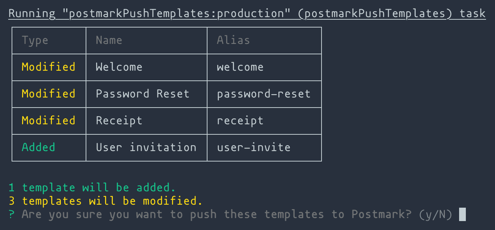

# grunt-postmark

> Send emails and manage your templates with [Postmark](http://postmarkapp.com) using GruntJS. This plugin is ideal for managing a template development workflow.

## Getting Started

This plugin requires that you have a [Postmark](http://postmarkapp.com) account and a valid server token. You can find your server token under the credentials tab on your Postmark server.

If you haven’t used [Grunt](http://gruntjs.com/) before, be sure to check out the [Getting Started](http://gruntjs.com/getting-started) guide, as it explains how to create a [Gruntfile](http://gruntjs.com/sample-gruntfile) as well as install and use Grunt plugins. Once you're familiar with that process, you may install this plugin with this command:

```shell
npm i grunt-postmark --save-dev
```

After the plugin is installed, it can be enabled in your Gruntfile:

```js
grunt.loadNpmTasks("grunt-postmark");
```

## The `postmark` task
This task lets you send emails from your Postmark account.

### Example

```js
grunt.initConfig({
  postmark: {
    options: {
      serverToken: "",
      from: "you@youremail.com",
      to: "you@youremail.com",
      subject: "Yo"
    },
    email: {
      src: ["test/emails/email.html"]
    },

    // You can also override global options by passing them into the target
    moreEmails: {
      serverToken: "",
      from: "you@youremail.com",
      to: "you@youremail.com",
      subject: "Yo",
      src: [
        "test/emails/email.html",
        "test/emails/email2.html"
      ]
    }
  }
});
```

### Options

#### serverToken
Your server token can be found on your server’s credentials page on [Postmark’s](http://postmarkapp.com) app. We recommend storing server tokens in a separate file that does not get committed to your repo. Check out our [Gruntfile](Gruntfile.js) for more details.

Type: `String`

#### from
The email address you’re sending the email from. This must be an email address on a verified domain or confirmed Sender Signature. Check out our [help doc](https://postmarkapp.com/support/article/846-how-can-i-send-on-behalf-of-my-users) for more info.

Type: `String`

#### to
The email address you’re sending to.

Type: `String`

####  subject

Type: `String`

#### src
Array of templates on your local system.

Type: `Array`


## The `postmarkPushTemplates` task
Push templates from your local file system to a specific Postmark server. Before you get started, you will need to create a template configuration file. You can do this manually by copying and editing [templates.example.json](templates.example.json). Or if you already have your tempaltes saved to a Postmark server, you can generate a boilerplate config and download the templates using the `postmarkTemplatesSetup` task.



### Example

```js
grunt.initConfig({
  postmarkPushTemplates: {
    options: {
      serverToken: "",
    },
    your_target: {
      options: {}, // Override global task options (optional)
      templates: [
        {
          "name": "Password Reset",
          "alias": "password-reset",
          "subject": "Reset your password",
          "htmlBody": "path/to/template.html",
          "textBody": "path/to/template.txt"
        }
      ]
    }
  }
});
```

### Options

#### serverToken
Your server token can be found under the credentials tab on your Postmark server. We recommend storing server tokens in a separate file that does not get committed to your repo. Check out our [Gruntfile](Gruntfile.js) for more details.

Type: `String`

#### showConfirmation
By default, this task will show you which templates are being modified or added and ask you to confirm the action pushing to Postmark.

Type: `boolean`<br>
Default: `true`

### Templates
Collection of templates to push to your Postmark server.

Type: `array`

```json
...
templates: [
  {
    "name": "Password Reset",
    "alias": "password-reset",
    "subject": "howdy",
    "htmlBody": "path/to/template.html",
    "textBody": "path/to/template.txt"
  }
]
...
```

#### name

Type: `String`

#### alias
Aliases let you identify templates so that they can be tracked and pushed across multiple Postmark servers. Aliases must start with a letter, and can only contain letters, numbers, and a few special characters(`-_.`). For more info check out our [help doc](https://account.postmarkapp.com/servers/3207781/templates/missing-alias).

Type: `String`

#### id _(Not recommended)_
You can also specify the template’s ID instead of an alias, however this limits you to only pushing a template to a single server. Aliases are highly recommended if you plan on pushing the same template across multiple Postmark servers.

Type: `Integer`

#### subject

Type: `String`

#### htmlBody
The path to the template’s HTML version.

Type: `String`

#### textBody
The path to the template’s text version.

Type: `String`

## The `postmarkTemplatesSetup` task
This task generates a boilerplate config file and saves templates from a Postmark server to your local file system. The config file can then be used to push your templates with the `postmarkPushTemplates` task. See [templates.example.json](templates.example.json) for more details on the JSON structure generated by this task.

### Example

```js
grunt.initConfig({
  postmarkTemplatesSetup: {
    options: {
      serverToken: "",
      configOutputFile: "templates-server.example.json",
      templateOutputDest: "path/to/dest/"
    }
  }
});
```

### Options

#### serverToken
Your server token can be found under the credentials tab on your Postmark server. We recommend storing server tokens in a separate file that does not get committed to your repo. Check out our [Gruntfile](Gruntfile.js) for more details.

Type: `String`

#### configOutputFile
Specify the path and name of the config output file.

Type: `String`

#### templateOutputDest
Specify where you want to save the templates. Leave this blank if you prefer not to save template content.

Type: `String`
